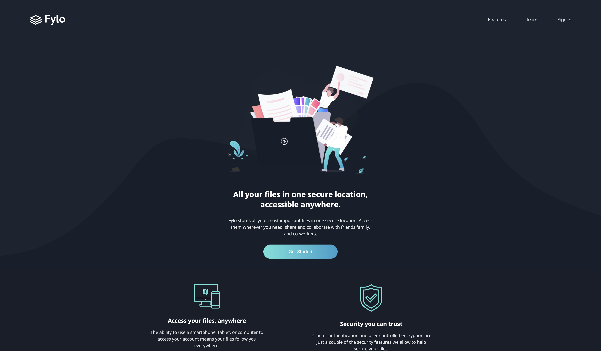

# Frontend Mentor - Fylo dark theme landing page solution

This is a solution to the [Fylo dark theme landing page challenge on Frontend Mentor](https://www.frontendmentor.io/challenges/fylo-dark-theme-landing-page-5ca5f2d21e82137ec91a50fd). Frontend Mentor challenges help you improve your coding skills by building realistic projects.

## Table of contents

- [Overview](#overview)
  - [The challenge](#the-challenge)
  - [Screenshot](#screenshot)
  - [Links](#links)
- [My process](#my-process)
  - [Built with](#built-with)
- [Author](#author)

## Overview

### The challenge

Users should be able to:

- View the optimal layout for the site depending on their device's screen size
- See hover states for all interactive elements on the page

### Screenshot

### Links

- Solution URL: [https://github.com/TomLi0421/fylo-dark-theme-landing-page](https://github.com/TomLi0421/fylo-dark-theme-landing-page)
- Live Site URL: [https://tomli0421.github.io/fylo-dark-theme-landing-page](https://tomli0421.github.io/fylo-dark-theme-landing-page)

## My process

### Built with

- Semantic HTML5 markup
- CSS custom properties
- Flexbox
- CSS Grid
- Mobile-first workflow
- [React](https://react.dev/) - JS library
- [Tailwind CSS](https://tailwindcss.com) - For styles
- [Font Awesome](https://fontawesome.com/) - For icon

## Author

- Website - [https://tomli0421.github.io/Personal-site/](https://tomli0421.github.io/Personal-site/)
- GitHub - [TomLi0421](https://github.com/TomLi0421)
- Frontend Mentor - [@TomLi0421](https://www.frontendmentor.io/profile/TomLi0421)
